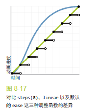

## PC端常规序列帧动画

代码[github](https://github.com/Xia-Ao/FrontendDemo/blob/master/30-CSS/03-animation/%E5%BA%8F%E5%88%97%E5%B8%A7%E5%8A%A8%E7%94%BB.html)

使用sprite图和background-position，再加上animation的step函数，可以实现序列帧动画，但是在移动端不推荐，因为移动端进行适配之后会出现序列帧抖动

### 实现

```css
.ex1 {
        width: 750px;
        height: 41px;
        background: url("tips.png");
        overflow: hidden;
        animation: tips 2s infinite steps(25);
    }

    @keyframes tips {
        from {
            background-position: 0 0px;
        }
        to {
            background-position: 0 -1025px;
        }
    }
```

使用step函数进行步进，你有多少帧动画，step步进数量就是多少，下面有一张很形象的图表示,steps() 会根据你指定的步进数量，把整个动画切分为多帧，而且整个动画会在帧与帧之间硬切，不会做任何插值处理。通常，这种硬切效果是我们极力避免的，因此我们很少听到关于steps() 的讨论。在CSS调速函数的世界里，基于贝塞尔曲线的调速函数就像是处处受人追捧的白天鹅，而steps()则是旁人避之唯恐不及的丑小鸭。不过，在这个案例中，后者却是我们通向成功的关键。一旦把整个动画的代码修改为下面的形式，这个加载提示就瞬间变成我们想要的样子了：


## 可缩放的序列帧动画
一次需求，好多个重复的动画，但是每个图片动画的大小不一样，提供一个序列帧图片，有什么办法可以实现一张sprite图做成可缩放的序列帧动画，一开始想到就是background-size，这个思路没有错，但是使用绝对像素就不对了。

当然，这种问题网上肯定有大神解答，腾讯前端团队就开发出一个插件gka进行制作可缩放的雪碧帧动画[地址](http://www.alloyteam.com/2017/07/12948/)，

原理剖析
当背景图片设置 background-size:100% 100% 时，百分比是以元素宽高为基准的，应用到雪碧图上会将整张雪碧图拉伸填充整个元素，例如我们有一个5帧的雪碧图，当我们设置`background-size: 100% 500%`时，高度就可以只显示一张图片，同理，background-position也可以设置为百分比，动画的过程从0%到500%，刚刚好显示完五张帧图片。

具体的列子：
```
.btn2 {
    width: 600px;
    height: 600px;
    background: url("btn.png");
    background-size: 100% 2500%;
    overflow: hidden;
    animation: btn2 1s infinite steps(25);
}

@keyframes btn2 {
    from {
        background-position: 0 0;
    }
    to {
        background-position: 0 -2500%;
    }
}

```
