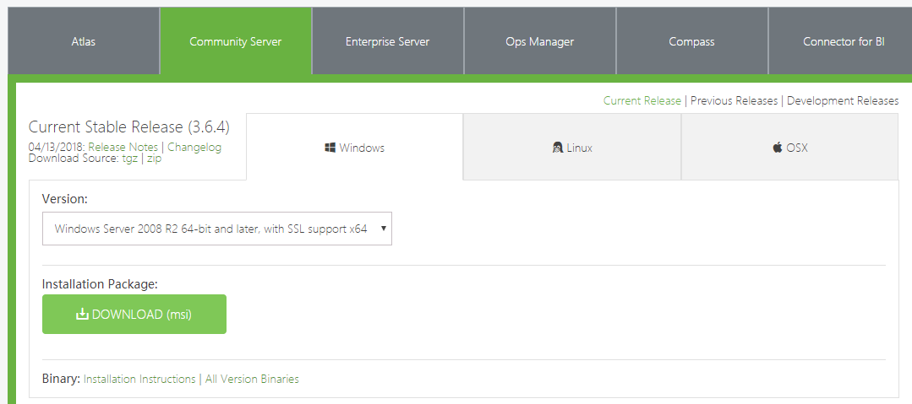
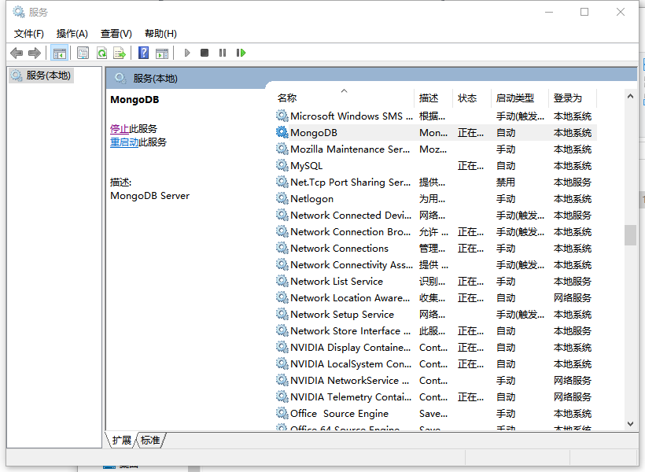
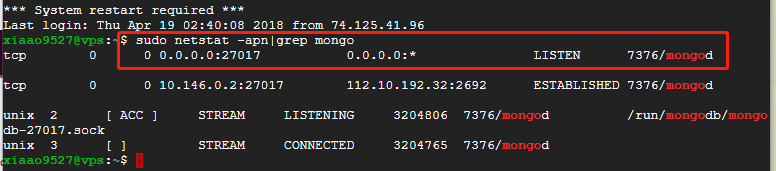

## 安装
### window下安装
参考：[windows32位系统 安装MongoDB](http://www.imooc.com/article/18438)

**1、下载**


**2、安装**
将msi文件点击安装，过程中会让你选择安装mongodb的可是或操作工具mongodb compress软件，自己决定是否安装。

**3、配置环境变量**

在系统环境变量path中添加mongodb的安装路径下的bin目录，这样使用cmd时可以运行mongo等相关命令。
path中添加一条`C:\Program Files\MongoDB\Server\3.2\bin  `

**4、配置mongodb**

a.在c:\\MongoDB（可随意起）下面建一个data文件夹 c:\\MongoDB\\data

b.在c:\\MongoDB（可随意起）下面建一个logs文件夹 c:\\MongoDB\\logs ，在里面建一个文件mongo.log

c.在c:\\MongoDB（可随意起）下面建一个etc(随意起，放配置文件)文件夹 c:\\MongoDB\\etc ,在里面建一个文件mongo.conf

d.打开mongo.conf文件，修改如下：
```
#数据库路径
dbpath=c:\\MongoDB\\data\\

#日志输出文件路径
logpath=c:\\MongoDB\\logs\\mongodb.log

#错误日志采用追加模式，配置这个选项后mongodb的日志会追加到现有的日志文件，而不是从新创建一个新文件
logappend=true

#启用日志文件，默认启用
journal=true

#这个选项可以过滤掉一些无用的日志信息，若需要调试使用请设置为false
quiet=false

#端口号 默认为27017
port=27017

#指定存储引擎（默认先不加此引擎，如果报错了，大家在加进去,这条配置主要针对win32用户，win10以上用户一般不会有这个问题）
storageEngine=mmapv1
```
完成以上操作后，我们就可以启动我们的mongo数据库了。

**5、启动mongodb**

命令行启动：
```
# 管理员下启动
#  mongod --config D:\MongoDB\etc\mongo.conf
```
添加到window服务中，开机自启动
```
mongod --config c:\MongoDB\etc\mongo.conf --install --serviceName "MongoDB"  
```
然后可以在window服务中看到对应名称为MongoDB的服务。每次开机的时候可以自动启动。


### linux下安装

#### ubuntu 17.0+下安装
一般在ubuntu下安装mongodb使用压缩包，然后解压缩配置，网上有很多关于这块的教程，但是再ubuntu 17以上版本中，不知道什么原因，这个方法操作没有办法启动数据库，所以使用apt-get方法安装配置mongoDB数据库。

参考：[Ubuntu下MongoDB的安装和使用](https://blog.csdn.net/Flyfish111222/article/details/51886787)

**安装：**

1、`sudo apt-get install mongodb`

2、`mongo -version`  //查看mongodb版本

3、启动关闭mongodb服务
```
service mongodb start 
service mongodb stop
```

4、检查mongdb是否开启
```
sudo netstat -apn|grep mongo
```


5、卸载mongodb
```
sudo apt-get --purge remove mongodb mongodb-clients mongodb-server
```

**配置：**
[Ubuntu下开启MongoDB用户权限](https://blog.csdn.net/Flyfish111222/article/details/51886840)

参考：

mongodb的配置文件mongodb.conf默认在`/etc/mongodb.conf`路径下，修改配置文件。
```
sudo vim /etc/mongodb.conf
```
主要修改以下几项
```
dbpath=/var/lib/mongodb
//设置数据存放路径，可以自定义，这里我不做修改

logpath=/var/log/mongodb/mongodb.log
//设置日志文件存放路径，可以自定义，这里我不做修改

logappend=true
//启用日志过滤

#bind_ip = 127.0.0.1
//默认开启，只能本机连接，设置为关闭绑定IP，允许外部ip连接
port = 27017
//设置默认端口27017

```
然后重启mongodb服务。

开启用户权限参考博文。

#### 推荐使用mongoDB compress可视化工具

## mongo语法


`show dbs`  :查看所有 数据库  
`show users`:显示所有用户  
`use store`：切换当前数据库至store  
`db.help()` ：显示数据库操作命令   
`db.yourCollection.help()` ：显示集合操作命令，yourCollection是集合名  
`db.creatCollection('users')` : 创建一个集合，即table表  
`db.users.insert({"userName": "admin"})` : 向users表中插入一条数据  
`db.users.find()`: 查询users表中的所有数据
`db.users.update({"userName": "admin"}, {$set: {"cartList": "fhk", false, true)`: 修改更新数据，匹配到userName,然后再更新cartList

命令行下导入数据
`$  mongoimport -d store -c users --file filePath --type json` -d 数据库 ， -c table表 --file 要导入的文件 --type 文件类型


