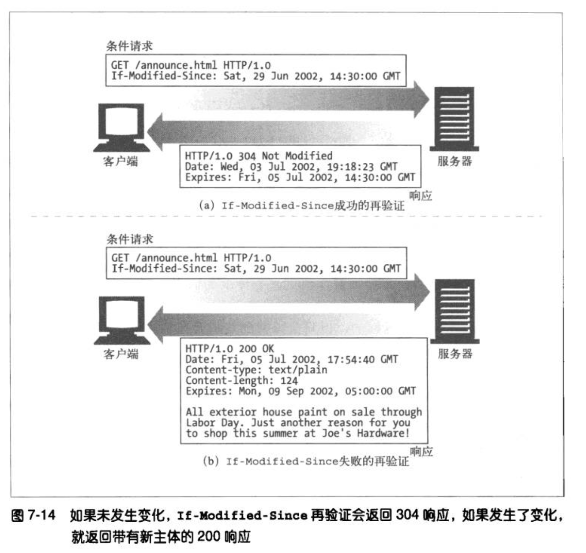
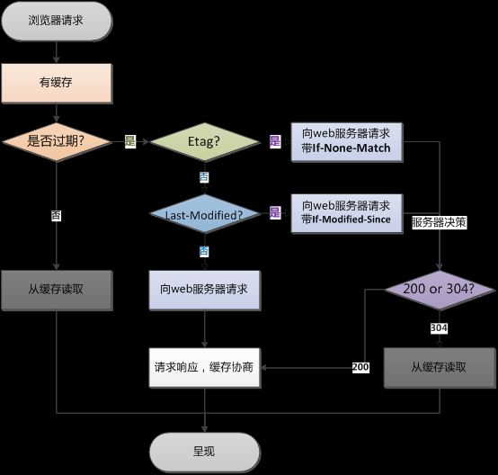

缓存一直是一个高频的问题，在使用的过程中，一般遵循默认，不会刻意进行浏览器缓存，在HTTP权威指南上有这样一张图。


总的来说，客户端从服务器请求数据经历如下基本步骤:
1. 检查是否已缓存：如果请求命中本地缓存则从本地缓存中获取一个对应资源的副本；
2. 检查这个资源是否新鲜：是则直接返回到客户端，否则继续向服务器转发请求，进行再验证。
3. 再验证阶段：服务器接收到请求，然后再验证判断资源是否相同，是则返回`304 not modified`，未变更。 否则返回新内容和`200`状态码。
4. 客户端更新本地缓存。

如果请求到达缓存，混油三种情况
* 缓存命中， 返回200
* 缓存未命中，向服务器重新发送请求
* 缓存再验证命中

## 检查资源是否新鲜
http1.0中使用Expires策略，在http1.1中，使用Cache-Control，目前浏览器主流使用HTTP1.1，Cache-Control的优先级高于Expires

### Expires
Expires 是http响应头，表示一个时间戳，在此时间内缓存有效，但是是一个绝对时间，不同地区会不一样。

### Cache-Control
用来指明资源的有效时间，是一个相对时间。

**request请求中的指令**
```
Cache-Control: max-age=<seconds>
Cache-Control: max-stale[=<seconds>]
Cache-Control: min-fresh=<seconds>
Cache-control: no-cache 
Cache-control: no-store
Cache-control: no-transform
Cache-control: only-if-cached
```
**response响应头中的指令**
```
Cache-control: must-revalidate
Cache-control: no-cache
Cache-control: no-store
Cache-control: no-transform
Cache-control: public
Cache-control: private
Cache-control: proxy-revalidate
Cache-Control: max-age=<seconds>
Cache-control: s-maxage=<seconds>
```

如果 `Expires` 或 `Cache-Control:max-age`验证未过期，即资源是新鲜的。则直接返回`200`状态码，使用缓存。 **这里注意缓存命中和访问原始服务器的响应码都是`200`**


#### Cache-Control指令含义

**可缓存性**

* `public`表明响应可以被任何对象（包括：发送请求的客户端，代理服务器，等等）缓存。
* `private`表明响应只能被单个用户缓存，不能作为共享缓存（即代理服务器不能缓存它）,可以缓存响应内容。
* `no-cache`在释放缓存副本之前，强制高速缓存将请求提交给原始服务器进行验证,而不经过本地缓存版本的校验
* `only-if-cached`表明客户端只接受已缓存的响应，并且不要向原始服务器检查是否有更新的拷贝

**到期**

* `max-age=<seconds>`设置缓存存储的最大周期，超过这个时间缓存被认为过期(单位秒)。与Expires相反，时间是相对于请求的时间。
* `s-maxage=<seconds>`覆盖max-age 或者 Expires 头，但是仅适用于共享缓存(比如各个代理)，并且私有缓存中它被忽略。
* `max-stale[=<seconds>]`表明客户端愿意接收一个已经过期的资源。 可选的设置一个时间(单位秒)，表示响应不能超过的过时时间。
* `min-fresh=<seconds>`表示客户端希望在指定的时间内获取最新的响应。
* `stale-while-revalidate=<seconds>`表明客户端愿意接受陈旧的响应，同时在后台异步检查新的响应。秒值指示客户愿意接受陈旧响应的时间长度。
* `stale-if-error=<seconds>`表示如果新的检查失败，则客户愿意接受陈旧的响应。秒数值表示客户在初始到期后愿意接受陈旧响应的时间。


**重新验证和重新加载**

* `must-revalidate`缓存必须在使用之前验证旧资源的状态，并且不可使用过期资源。
* `proxy-revalidate`与`must-revalidate`作用相同，但它仅适用于共享缓存（例如代理），并被私有缓存忽略。
* `immutable`表示响应正文不会随时间而改变。资源（如果未过期）在服务器上不发生改变，因此客户端不应发送重新验证请求头（例如If-None-Match或If-Modified-Since）来检查更新，即使用户显式地刷新页面。在Firefox中，immutable只能被用在 `https://` transactions. 有关更多信息，请参阅[这里](http://bitsup.blogspot.de/2016/05/cache-control-immutable.html).

**其他**

* `no-store`缓存不应存储有关客户端请求或服务器响应的任何内容。
* `no-transform`不得对资源进行转换或转变。Content-Encoding, Content-Range, Content-Type等HTTP头不能由代理修改。例如，非透明代理可以对图像格式进行转换，以便节省缓存空间或者减少缓慢链路上的流量。 no-transform指令不允许这样做。

## 服务器再验证
如果在浏览器端检查资源已经过期，会向服务器发送条件GET请求，带上一些请求头LastModify-Since和If-None-Match等进行验证

### If-Modified-Since／Last-Modified
在浏览器第一次请求某一个URL时，服务器端的返回状态会是 `200` ，内容是你请求的资源，同时有一个Last-Modified的属性标记(HttpReponse Header)此文件在服务期端最后被修改的时间，  
格式类似这样：

```
Last-Modified:Tue, 24 Feb 2009 08:01:04 GMT
```

客户端第二次请求此URL时，首先会判断是否有缓存以及缓存是否过期，如果缓存过期，浏览器会向服务器传送 **条件GET请求** ，包含 `If-Modified-Since`报头(HttpRequest Header)，询问该时间之后文件是否有被修改过：

```
If-Modified-Since:Tue, 24 Feb 2009 08:01:04 GMT 
```

web服务器收到请求后发现有头If-Modified-Since 则与被请求资源 **在客户端的最后修改时间 `Last-Modified`** 进行比对。若最后修改时间较新，说明资源又被改动过，则响应整片资源内容（写在响应消息包体内），响应状态码为 `HTTP 200`；若最后修改时间 `Last-Modified`较旧，说明资源无新修改，则 `响应HTTP 304` (这里只需要发送一个head头，包体内容为空，这样就节省了传输数据量)，告知浏览器继续使用所保存的cache。




### If-None-Match /Etag

HTTP协议规格引入ETag（被请求变量的实体标记），简单点即服务器响应时给请求URL标记，并在HTTP响应头中将其传送到客户端，类似服务器端返回的格式：
* Etag：web服务器响应请求时，告诉浏览器当前资源在服务器的唯一标识（生成规则由服务器觉得）。Apache中，ETag的值，默认是对文件的索引节（INode），大小（Size）和最后修改时间（MTime）进行Hash后得到的。
* If-None-Match：当资源过期时（使用Cache-Control标识的max-age），发现资源具有Etag声明，则再次向web服务器请求时带上头If-None-Match （Etag的值）。web服务器收到请求后发现有头If-None-Match 则与被请求资源的相应校验串进行比对，决定返回200或304。


#### 既生Last-Modified何生Etag？

你可能会觉得使用Last-Modified已经足以让浏览器知道本地的缓存副本是否足够新，为什么还需要Etag（实体标识）呢？HTTP1.1中Etag的出现主要是为了解决几个Last-Modified比较难解决的问题：
* `Last-Modified`标注的最后修改只能精确到秒级，如果某些文件在1秒钟以内，被修改多次的话，它将不能准确标注文件的修改时间
* 如果某些文件会被定期生成，但内容并没有任何变化，但Last-Modified却改变了，导致文件没法使用缓存
* 有些文档可能被修改了，但所做修改并不重要。（比如对注释或拼写的修改）
* 有可能存在服务器没有准确获取文件修改时间，或者与代理服务器时间不一致等情形

Etag是服务器自动生成或者由开发者生成的对应资源在服务器端的唯一标识符，能够更加准确的控制缓存。Last-Modified与ETag是可以一起使用的， **服务器会优先验证ETag，一致的情况下，才会继续比对Last-Modified，最后才决定是否返回304。**

但是Etag也存在一些问题，比如： **分布式系统尽量关闭掉Etag(每台机器生成的etag都会不一样)** 。Etag的服务器生成规则和强弱Etag的相关内容可以参考，[《互动百科-Etag》](http://www.baike.com/wiki/Etag),这里不再深入

Last-Modified和ETags请求的http报头一起使用，服务器首先产生Last-Modified/Etag标记，服务器可在稍后使用它来判断页面是否已经被修改，来决定文件是否继续缓存

过程如下:
1. 客户端请求一个页面（A）。
2. 服务器返回页面A，并在给A加上一个Last-Modified/ETag。
3. 客户端展现该页面，并将页面连同Last-Modified/ETag一起缓存。
4. 客户再次请求页面A，并将上次请求时服务器返回的Last-Modified/ETag一起传递给服务器。
5. 服务器检查该Last-Modified或ETag，并判断出该页面自上次客户端请求之后还未被修改，直接返回响应304和一个空的响应体。

#### Last-Modified/ETag与Cache-Control/Expires


如果检测到本地的缓存还是有效的时间范围内，浏览器直接使用本地副本，不会发送任何请求。两者一起使用时，`Cache-Control/Expires`的优先级要高于`Last-Modified/ETag`。即当本地副本根据`Cache-Control/Expires`发现还在有效期内时，则不会再次发送请求去服务器询问修改时间（Last-Modified）或实体标识（Etag）了。

一般情况下，使用Cache-Control/Expires会配合Last-Modified/ETag一起使用，因为即使服务器设置缓存时间, **当用户点击"刷新"按钮时，浏览器会忽略缓存继续向服务器发送请求，这时Last-Modified/ETag将能够很好利用`304`，从而减少响应开销。**

在请求过一次资源之后，再次请求资源时流程。




## 缓存的注意事项
1. 只有get请求会被缓存，post请求不会

2. Etag 在资源分布在多台机器上时，对于同一个资源，不同服务器生成的Etag可能不相同，此时就会导致304协议缓存失效，客户端还是直接从server取资源。可以自己修改服务器端Etag的生成方式，根据资源内容生成同样的Etag。

3. 系统上线，更新资源时，可以在资源uri后边附上资源修改时间、svn版本号、文件md5 等信息，这样可以避免用户下载到缓存的旧的文件。关于这方面的具体实践，可以参考[gulp解决资源压缩、合并和缓存更新问题](http://www.zyy1217.com/2017/05/12/gulp%E8%A7%A3%E5%86%B3%E5%89%8D%E7%AB%AF%E8%B5%84%E6%BA%90%E5%8E%8B%E7%BC%A9%E3%80%81%E5%90%88%E5%B9%B6%E5%92%8C%E7%BC%93%E5%AD%98%E6%9B%B4%E6%96%B0%E9%97%AE%E9%A2%98/)

4. 观察chrome的表现发现，通过链接或者地址栏访问，会先判断缓存是否过期，再判断缓存资源是否更新；F5刷新，会跳过缓存过期判断，直接请求服务器，判断资源是否更新。


## 补充：8种浏览器缓存机制
查看浏览器缓存，直接在chrome下打开devTools，application选项下面就是浏览器的8种缓存，其实还有一种，flash缓存，这种只有在使用flash的时候才使用，一般很少用到。


* HTTP缓存 对应Frames
* cookies
* LocalStorage
* SessionStorage
* IndexedDB
IndexedDB 是一个为了能够在客户端存储可观数量的结构化数据，并且在这些数据上使用索引进行高性能检索的 API。虽然 DOM 存储 对于存储少量数据是非常有用的，但是它对大量结构化数据的存储就显得力不从心了。IndexedDB 则提供了这样的一个解决方案。

IndexedDB 分别为同步和异步访问提供了单独的 API 。同步 API 本来是要用于仅供 Web Workers 内部使用，但是还没有被任何浏览器所实现。异步 API 在 Web Workers 内部和外部都可以使用，另外浏览器可能对indexDB有50M大小的限制，一般用户保存大量用户数据并要求数据之间有搜索需要的场景。
* Web SQL 小型数据库，允许SQL语句查询
* Cache Storage
CacheStorage是在ServiceWorker的规范中定义的。CacheStorage 可以保存每个serverWorker申明的cache对象，cacheStorage有open、match、has、delete、keys五个核心方法，可以对cache对象的不同匹配进行不同的响应。
* Application Cache
application cache是将大部分图片资源、js、css等静态资源放在manifest文件配置中。当页面打开时通过manifest文件来读取本地文件或是请求服务器文件。


## 参考
[《HTTP权威指南》之缓存详解](http://www.zyy1217.com/2017/05/14/HTTP%E7%BC%93%E5%AD%98%E8%AF%A6%E8%A7%A3/)