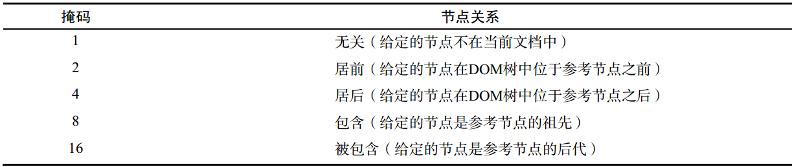

# Node属性及方法
# [Node官方API](https://developer.mozilla.org/zh-CN/docs/Web/API/Node)

## 属性

### [`Node.nodeName`](https://developer.mozilla.org/zh-CN/docs/Web/API/Node/nodeName) 只读
返回当前节点的节点名称

### [`Node.nodeValue`](https://developer.mozilla.org/zh-CN/docs/Web/API/Node/nodeValue)
Node.nodeValue 属性返回或设置当前节点的值。


### [`Node.childNodes`](https://developer.mozilla.org/zh-CN/docs/Web/API/Node/childNodes ) 只读
Node.childNodes 返回包含指定节点的子节点的集合，该集合为即时更新的集合（live collection）。


### [`Node.parentNode`](https://developer.mozilla.org/zh-CN/docs/Web/API/Node/parentNode ) 只读
返回指定的节点在DOM树中的父节点.

### [`Node.parentElement`](https://developer.mozilla.org/zh-CN/docs/Web/API/Node/parentElement) 只读
返回当前节点的父元素节点,如果该元素没有父节点,或者父节点不是一个元素节点.则 返回null.

### [`Node.previousSibling`](https://developer.mozilla.org/zh-CN/docs/Web/API/Node/previousSibling) 只读
返回当前节点的前一个兄弟节点,没有则返回null.

### [`Node.nextSibling`](https://developer.mozilla.org/zh-CN/docs/Web/API/Node/nextSibling) 只读
Node.nextSibling 是一个只读属性，返回其父节点的 childNodes 列表中紧跟在其后面的节点，如果指定的节点为最后一个节点，则返回 null。

### [`Node.firstChild`/ `Node.lastChild`](https://developer.mozilla.org/zh-CN/docs/Web/API/Node/firstChild) 只读
Node.firstChild 只读属性返回树中节点的第一个子节点/最后一个子节点，如果节点是无子节点，则返回 null。

### [`Node.textContent`](https://developer.mozilla.org/zh-CN/docs/Web/API/Node/textContent)
Node.textContent 属性表示一个节点及其后代的文本内容。


**方法**
### [`Node.appendChild()`](https://developer.mozilla.org/zh-CN/docs/Web/API/Node/appendChild)
Node.appendChild() 方法将一个节点添加到指定父节点的子节点列表末尾。

### [`Node.cloneNode()`](https://developer.mozilla.org/zh-CN/docs/Web/API/Node/cloneNode)
Node.cloneNode() 方法返回调用该方法的节点的一个副本.


### node.contains( otherNode )
如果 `otherNode` 是 `node 的后代节点或是` `node` 节点本身.则返回`true` , 否则返回 `false`.


### node.compareDocumentPosition( otherNode )
* `node`是要和otherNode比较位置的节点.
* `otherNode`是被和node比较位置的节点.
返回值是`otherNode`节点和`node节点的位置关系`.




### [`Node.hasChildNodes()`](https://developer.mozilla.org/zh-CN/docs/Web/API/Node/hasChildNodes)
"hasChildNodes方法返回一个布尔值,表明当前节点是否包含有子节点."

### [`Node.isEqualNode()`](https://developer.mozilla.org/zh-CN/docs/Web/API/Node/isEqualNode)
Node.isEqualNode() 方法可以判断两个节点是否相等。当两个节点的类型相同，定义特征(defining characteristics)相同（对元素来说，即 id，孩子节点的数量等等），属性一致等，这两个节点就是相等的。一些具体的数据指出：多数时候的比较是根据节点的类型来的。

### [`Node.removeChild()`](https://developer.mozilla.org/zh-CN/docs/Web/API/Node/removeChild)
Node.removeChild() 方法从DOM中删除一个子节点。返回删除的节点。

### [`Node.replaceChild()`](https://developer.mozilla.org/zh-CN/docs/Web/API/Node/replaceChild)
用指定的节点替换当前节点的一个子节点，并返回被替换掉的节点。


# Element
# [官方API](https://developer.mozilla.org/zh-CN/docs/Web/API/Element)

## 属性

### [`Element.attributes`](https://developer.mozilla.org/zh-CN/docs/Web/API/Element/attributes) 只读
Element.attributes 属性返回该元素所有属性节点的一个实时集合。该集合是一个 NamedNodeMap 对象，不是一个数组，所以它没有 数组 的方法，其包含的 属性 节点的索引顺序随浏览器不同而不同。更确切地说，attributes 是字符串形式的名/值对，每一对名/值对对应一个属性节点。

### [`Element.classList`](https://developer.mozilla.org/zh-CN/docs/Web/API/Element/classList) 只读
Element.classList 是一个只读属性，返回一个元素的类属性的实时 DOMTokenList集合。
* `add()`
* `contains()` 是否包含，返回Boolean
* `remove()`
* `toggle()` 如果列表中已经存在给定的值，删除它，如果没有，添加它

### [`lement.className`](https://developer.mozilla.org/zh-CN/docs/Web/API/Element/className )
className 获取或设置指定元素的class属性的值。

### [`Element.innerHTML`](https://developer.mozilla.org/zh-CN/docs/Web/API/Element/innerHTML)
 "Element.innerHTML 属性设置或获取HTML语法表示的元素的后代。"

### [`Element.outerHTML`](https://developer.mozilla.org/zh-CN/docs/Web/API/Element/outerHTML )
"element DOM接口的 outerHTML属性, 获取描述包括其后代的元素的序列化HTML片段。它可以用从给定字符串解析的节点设置为替换元素。"


### [`Element.tagName`](https://developer.mozilla.org/zh-CN/docs/Web/API/Element/tagName )
"返回当前元素的标签名"
### [`Element.scrollHeight / scrollWidth`](https://developer.mozilla.org/zh-CN/docs/Web/API/Element/scrollHeight ) 只读
"Element.scrollHeight 这个只读属性是一个元素内容高度的度量，包括由于溢出导致的视图中不可见内容。没有垂直滚动条的情况下，scrollHeight值与元素视图填充所有内容所需要的最小值clientHeight相同。包括元素的padding，但不包括元素的border和margin。scrollHeight也包括 ::before 和 ::after这样的伪元素。"
### [`Element.scrollTop`](https://developer.mozilla.org/zh-CN/docs/Web/API/Element/scrollTop )
"Element.scrollTop 属性可以获取或设置一个元素的内容垂直滚动的像素数。"

### [`Element.scrollLeft`](https://developer.mozilla.org/zh-CN/docs/Web/API/Element/scrollLeft )
"Element.scrollLeft 属性可以读取或设置元素滚动条到元素左边的距离。"

## 方法

### [`EventTarget.addEventListener()`/ `EventTarget.removeEventListener()`](https://developer.mozilla.org/zh-CN/docs/Web/API/EventTarget/addEventListener)
EventTarget.addEventListener() 方法将指定的监听器注册到 EventTarget 上，当该对象触发指定的事件时，指定的回调函数就会被执行。 事件目标可以是一个文档上的元素 Document 本身，或者任何其他支持事件的对象 (比如 XMLHttpRequest)。

### [`Element.closest()`](https://developer.mozilla.org/zh-CN/docs/Web/API/Element/closest )
Element.closest() 方法用来获取：匹配特定选择器且离当前元素最近的祖先元素（也可以是当前元素本身）。如果匹配不到，则返回 null。
```
var  *elt =*  *element* .closest( *selectors* ); 
```
参数：
* *selectors* 是指定的选择器，比如 `"p:hover, .toto + q"。`
* *element* 表示当前元素。
返回值：

* *elt* 是查询到的祖先元素，也可能是 `null。`

### [`EventTarget.dispatchEvent()`](https://developer.mozilla.org/zh-CN/docs/Web/API/EventTarget/dispatchEvent ) 不是很懂
"向一个指定的事件目标派发一个事件,  以合适的顺序触发受影响的 事件目标。标准事件处理规则(包括事件捕获和可选的冒泡过程)同样适用于通过手动的使用dispatchEvent()方法派发的事件。"


### [`Element.getBoundingClientRect()`](https://developer.mozilla.org/zh-CN/docs/Web/API/Element/getBoundingClientRect ) 用来获取位置
Element.getBoundingClientRect()方法返回元素的大小及其相对于视口的位置。"

返回值是一个 [DOMRect](https://developer.mozilla.org/zh-CN/docs/Mozilla/Tech/XPCOM/Reference/Interface/nsIDOMClientRect) 对象，这个对象是由该元素的 [`getClientRects()`](https://developer.mozilla.org/zh-CN/docs/Web/API/Element/getClientRects "DOM/element.getClientRects") 方法返回的一组矩形的集合, 即：是与该元素相关的CSS 边框集合 。`{x, y, top, bottom, left, right, width, height}`
right是指元素右边界距窗口最左边的距离，bottom是指元素下边界距窗口最上面的距离。

### [`Element.getClientRects()`](https://developer.mozilla.org/zh-CN/docs/Web/API/Element/getClientRects)
Element.getClientRects() 方法返回一个指向客户端中每一个盒子的边界矩形的矩形集合。

### [`Element.getElementBy...`](https://developer.mozilla.org/zh-CN/docs/Web/API/Element)


### [`Element.insertAdjacentHTML`](https://developer.mozilla.org/zh-CN/docs/Web/API/Element/insertAdjacentHTML)
"insertAdjacentHTML() 将指定的文本解析为HTML或XML，并将结果节点插入到DOM树中的指定位置。它不会重新解析它正在使用的元素，因此它不会破坏元素内的现有元素。这避免了额外的序列化步骤，使其比直接innerHTML操作更快。"
```html
element.insertAdjacentHTML(position, text);
```
position是相对于元素的位置，并且必须是以下字符串之一：
* **beforebegin**元素自身的前面。
* **afterbegin**插入元素内部的第一个子节点之前`。`
* **beforeend**  插入元素内部的最后一个子节点之后。
* **afterend**   元素自身的后面。
text是要被解析为HTML或XML,并插入到DOM树中的字符串。

### [`Element.matches(selectorString)`](https://developer.mozilla.org/zh-CN/docs/Web/API/Element/matches )
如果元素被指定的选择器字符串选择，Element.matches()  方法返回true; 否则返回false。

### [`Element.querySelector()`](https://developer.mozilla.org/zh-CN/docs/Web/API/Element/querySelector )
基础元素（baseElement）的子元素中满足指定选择器组的第一个元素。匹配过程会对整个结构进行，包括基础元素和他的后代元素的集合以外的元素，也就是说，选择器首先会应用到整个文档，而不是基础元素，来创建一个可能有匹配元素的初始列表。然后从结果元素中检查它们是否是基础元素的后代元素。第一个匹配的元素将会被querySelector()方法返回。

### [`Element.querySelectorAll`](https://developer.mozilla.org/zh-CN/docs/Web/API/Element/querySelectorAll)
返回一个non-live的NodeList, 它包含所有元素的非活动节点，该元素来自与其匹配指定的CSS选择器组的元素。(基础元素本身不包括，即使它匹配。)

### [`ChildNode.remove()`](https://developer.mozilla.org/zh-CN/docs/Web/API/ChildNode/remove)
ChildNode.remove() 方法把从它所属的DOM树中删除对象。


### [`Element.getAttribute()`](https://developer.mozilla.org/zh-CN/docs/Web/API/Element/getAttribute)
getAttribute() 返回元素上一个指定的属性值。如果指定的属性不存在，则返回  null 或 \"\" （空字符串）；具体细节, 请参阅  Notes 部分。

### [`Element.setAttribute()`](https://developer.mozilla.org/zh-CN/docs/Web/API/Element/setAttribute)
设置指定元素上的一个属性值。

### [`Element.hasAttribute()`](https://developer.mozilla.org/zh-CN/docs/Web/API/Element/hasAttribute )
hasAttribute 返回一个布尔值，指示该元素是否包含有指定的属性（attribute）。

### [`Element.removeAttribute()`](https://developer.mozilla.org/zh-CN/docs/Web/API/Element/removeAttribute)
removeAttribute() 从指定的元素中删除一个属性。

###


