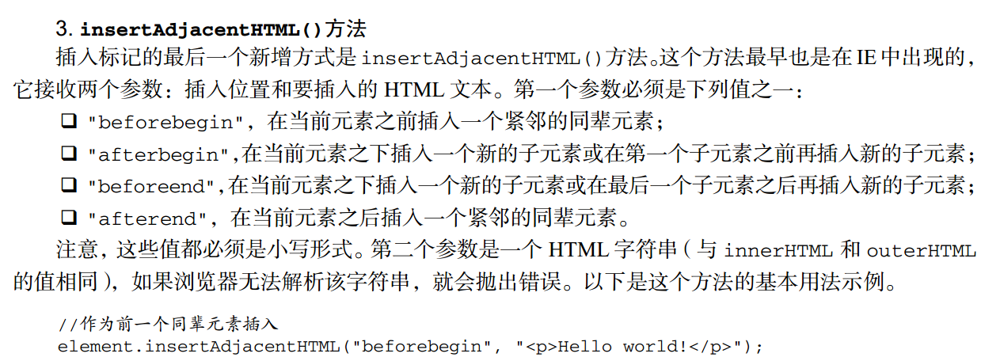
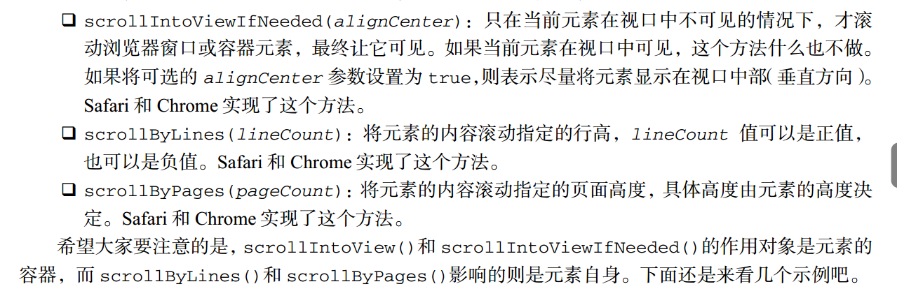

# DOM扩展中的API

### querySelector()
匹配第一个元素，
### querySelectorAll()
匹配所有的，返回NodeList

### classList
下面方法都可以接受多个参数
* `add()`
* `contains()` 是否包含，返回Boolean
* `remove()`
* `toggle()` 如果列表中已经存在给定的值，删除它，如果没有，添加它

### insertAdjacentHTML(position,html)

### scrollIntoView();
使元素滚动到视口，这事一个还在约定的API，浏览器支持性不好

### element.contains(targetElement)
检查是否包含子节点，返回Boolean,只能是父>子

### element.compareDocumentPosition(target.Element)
检测两个节点的关系，返回状态码

### scroll 滚动
