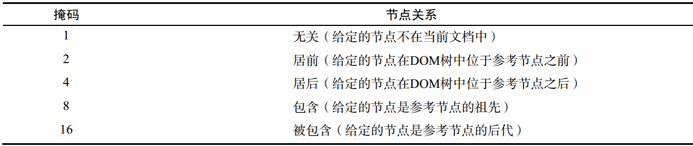

# DOM扩展中的API

### querySelector()
匹配第一个元素，
### querySelectorAll()
匹配所有的，返回NodeList

### classList
下面方法都可以接受多个参数
* `add()`
* `contains()` 是否包含，返回Boolean
* `remove()`
* `toggle()` 如果列表中已经存在给定的值，删除它，如果没有，添加它

### insertAdjacentHTML(position,html)

### scrollIntoView();
使元素滚动到视口，这事一个还在约定的API，浏览器支持性不好

## Node属性及方法
# [Node官方API](https://developer.mozilla.org/zh-CN/docs/Web/API/Node)

**属性**

**方法**
### [`Node.appendChild()`](https://developer.mozilla.org/zh-CN/docs/Web/API/Node/appendChild)
Node.appendChild() 方法将一个节点添加到指定父节点的子节点列表末尾。

### [`Node.cloneNode()`](https://developer.mozilla.org/zh-CN/docs/Web/API/Node/cloneNode)
Node.cloneNode() 方法返回调用该方法的节点的一个副本.

### node.contains( otherNode )
如果 `otherNode` 是 `node 的后代节点或是` `node` 节点本身.则返回`true` , 否则返回 `false`.

### node.compareDocumentPosition( otherNode )
* `node`是要和otherNode比较位置的节点.
* `otherNode`是被和node比较位置的节点.
返回值是`otherNode`节点和`node节点的位置关系`.

### [`Node.hasChildNodes()`](https://developer.mozilla.org/zh-CN/docs/Web/API/Node/hasChildNodes)
"hasChildNodes方法返回一个布尔值,表明当前节点是否包含有子节点."

### [`Node.isEqualNode()`](https://developer.mozilla.org/zh-CN/docs/Web/API/Node/isEqualNode)
Node.isEqualNode() 方法可以判断两个节点是否相等。当两个节点的类型相同，定义特征(defining characteristics)相同（对元素来说，即 id，孩子节点的数量等等），属性一致等，这两个节点就是相等的。一些具体的数据指出：多数时候的比较是根据节点的类型来的。

### [`Node.removeChild()`](https://developer.mozilla.org/zh-CN/docs/Web/API/Node/removeChild)
Node.removeChild() 方法从DOM中删除一个子节点。返回删除的节点。

### [`Node.replaceChild()`](https://developer.mozilla.org/zh-CN/docs/Web/API/Node/replaceChild)
用指定的节点替换当前节点的一个子节点，并返回被替换掉的节点。

## Element
# [官方API](https://developer.mozilla.org/zh-CN/docs/Web/API/Element)

### [`Element.attributes`](https://developer.mozilla.org/zh-CN/docs/Web/API/Element/attributes) ==只读==
Element.attributes 属性返回该元素所有属性节点的一个实时集合。该集合是一个 NamedNodeMap 对象，不是一个数组，所以它没有 数组 的方法，其包含的 属性 节点的索引顺序随浏览器不同而不同。更确切地说，attributes 是字符串形式的名/值对，每一对名/值对对应一个属性节点。

### [`Element.classList`](https://developer.mozilla.org/zh-CN/docs/Web/API/Element/classList) ==只读==
Element.classList 是一个只读属性，返回一个元素的类属性的实时 DOMTokenList集合。

### [`lement.className`](https://developer.mozilla.org/zh-CN/docs/Web/API/Element/className )
className 获取或设置指定元素的class属性的值。

### [`Element.innerHTML`](https://developer.mozilla.org/zh-CN/docs/Web/API/Element/innerHTML)
 "Element.innerHTML 属性设置或获取HTML语法表示的元素的后代。"

### [`Element.outerHTML`](https://developer.mozilla.org/zh-CN/docs/Web/API/Element/outerHTML )
"element DOM接口的 outerHTML属性, 获取描述包括其后代的元素的序列化HTML片段。它可以用从给定字符串解析的节点设置为替换元素。"

### [`Element.tagName`](https://developer.mozilla.org/zh-CN/docs/Web/API/Element/tagName )
"返回当前元素的标签名"
### [`Element.scrollHeight`](https://developer.mozilla.org/zh-CN/docs/Web/API/Element/scrollHeight ) ==只读==
"Element.scrollHeight 这个只读属性是一个元素内容高度的度量，包括由于溢出导致的视图中不可见内容。没有垂直滚动条的情况下，scrollHeight值与元素视图填充所有内容所需要的最小值clientHeight相同。包括元素的padding，但不包括元素的border和margin。scrollHeight也包括 ::before 和 ::after这样的伪元素。"

### scroll 滚动

## DOM中新添加的方法

### importNode(oldNode, true)
和cloneNode方法相近，但是importNode可以跨文档。

### isSupported()
确定
