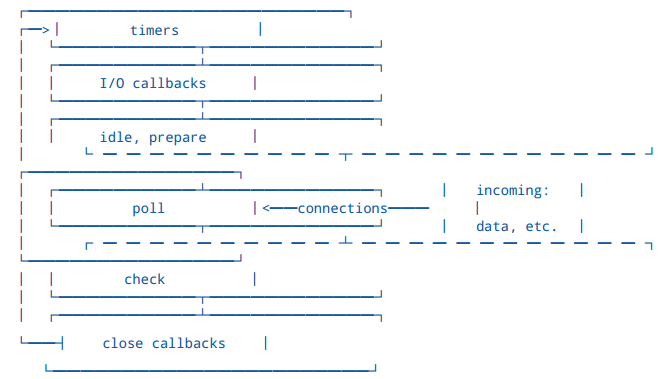
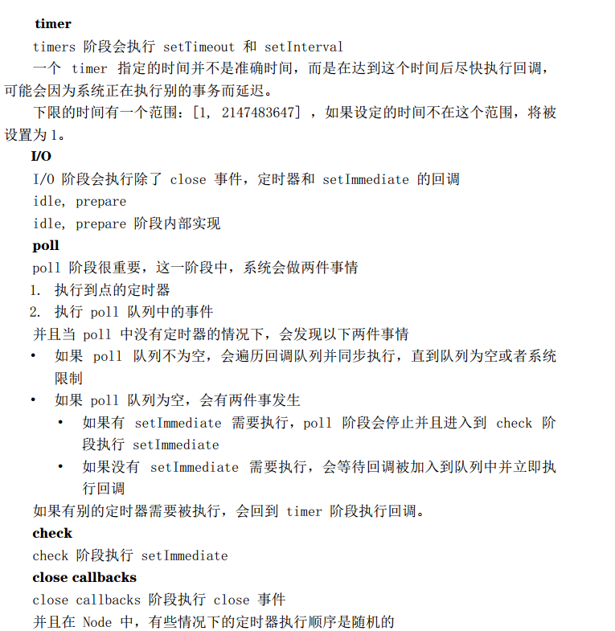

**同步**：一个进程在执行某个请求的时候，若该请求需要一段时间才能返回信息，那么这个进程将会一直等待下去，直到收到返回信息才继续执行下去。

**异步**：进程不需要一直等下去，而是继续执行下面的操作，不管其他进程的状态。当有消息返回时系统会通知进程进行处理，这样可以提高执行的效率。

**进程**：狭义上，就是正在运行的程序的实例。广义上，进程是一个具有一定独立功能的程序关于某个数据集合的一次运行活动。它是操作系统动态执行的基本单元，在传统的操作系统中，进程既是基本的分配单元，也是基本的执行单元。

**线程**：线程是程序中一个单一的顺序控制流程。进程内一个相对独立的、可调度的执行单元，是系统独立调度和分派CPU的基本单位。指运行中的程序的调度单位。

**单线程**：单线程在程序执行时，所走的程序路径按照连续顺序排下来，前面的必须处理好，后面的才会执行。单线程就是进程里只有一个线程。

**多线程**：在单个程序中同时运行多个线程完成不同的工作，称为多线程。

### [浏览器内核、JS 引擎、页面呈现原理及其优化](https://www.zybuluo.com/yangfch3/note/671516)

### [从Chrome源码看浏览器如何构建DOM树](https://zhuanlan.zhihu.com/p/24911872?refer=dreawer)

## 时间循环机制EventLoop

JS 是门非阻塞单线程语言，因为在最初 JS 就是为了和浏览器交互而诞生的。如果 JS 是门多线程的语言话，我们在多个线程中处理 DOM 就可能会发生问题（一个线程中新加节点，另一个线程中删除节点），当然可以引入读写锁解决这个问题。JS在执行的过程中会产生执行环境，这些执行环境会被顺序的加入到执行栈中。如果遇到异步的代码，会被挂起并加入到 Task（有多种 task） 队列中。一旦执行栈为空，Event Loop 就会从 Task 队列中拿出需要执行的代码并放入执行栈中执行，所以本质上来说 JS 中的异步还是同步行为。

不 同 的 任 务 源 会 被 分 配 到 不 同 的 Task 队 列 中， 任 务 源 可 以 分 为 微 任 务（microtask） 和 宏任务（macrotask）。在 ES6 规范中，microtask 称为 jobs，macrotask 称为 task。

微任务包括 process.nextTick ，promise ，Object.observe ，MutationObserver  
宏任务包括 script ， setTimeout ，setInterval ，setImmediate ，I/O ，UI  
rendering  
很多人有个误区，认为微任务快于宏任务，其实是错误的。因为宏任务中包括了script ，浏览器会先执行一个宏任务，接下来有异步代码的话就先执行微任务。

所以正确的一次 Event loop 顺序是这样的

1. 执行同步代码，这属于宏任务
2. 执行栈为空，查询是否有微任务需要执行
3. 执行所有微任务
4. 必要的话渲染 UI
5. 然后开始下一轮 Event loop，执行宏任务中的异步代码

**例子**：最典型的例子就是Promise和SetTimeOut。网上这块的例子很多，这里就不列举了。

## Node中的Event loop

node中的Event loop和浏览器中的不相同，  
Node 的 Event loop 分为 6 个阶段，它们会按照顺序反复运行

