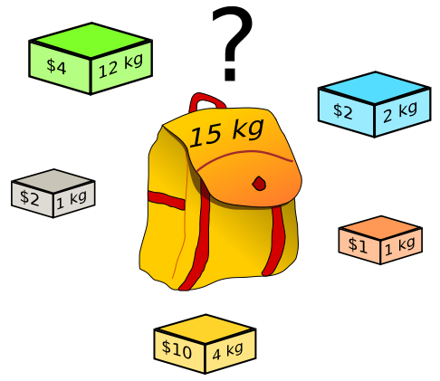
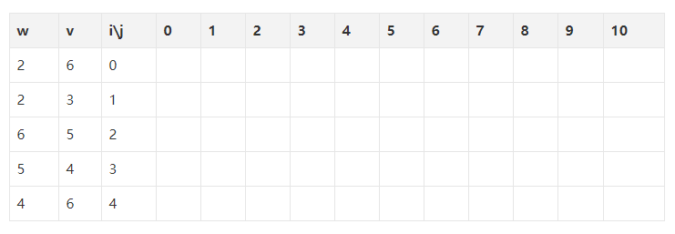
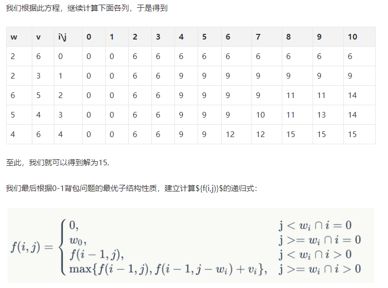

# 经典算法-动态规划

每每提到动态规划的时候，一开始不是很懂，总是跳过跳过，觉得前端的算法一般都是一些字符串操作，排序什么的，不太会有这种稍微复杂一点的算法，第一梯队的公司注重基础，第二梯队的公司看中算法，没办法，两方面的都要准备，而且，算法这块会了就是以后都会了，总归是好事。

### 动态规划抽象说明
它的思想就是把一个大的问题进行 **拆分** ，细分成一个个小的子问题，且能够从这些小的子问题的解当中推导出原问题的解。同时还需要满足以下两个重要性质才能进行动态规划
* 最优子结构性: 既所拆分的子问题的解是最优解。

* 子问题重叠性质: 既在求解的过程当中，每次产生的子问题并不总是新问题，有些子问题会被重复计算多次。动态规划算法正是利用了这种子问题的重叠性质，对每一个子问题只计算一次，然后将其计算结果保存在一个表格中，当再次需要计算已经计算过的子问题时，只是在表格中简单地查看一下结果，从而获得较高的解题效率

其实最重要的期子问题重叠，一般使用递归或者暴力穷举的方法，因为没有记录相同的子问题，又重新计算了一边，这对于小批量的数据还可以接受，但是对于数据量大的来说，时间时间耗时上完全行不通。

[一个动态规划问题--钢条切割](http://www.lizhiqianduan.com/blog/index.php/2018/08/02/cut-rod-by-dynamic-programming/)

这个问题就是一个典型的动态规划，**将问题划分为多个子问题，但是子问题里面会有相同的，然后使用空间存储，相同问题只计算一次。**

[JavaScript 版动态规划算法题：打家劫舍](http://www.liuyiqi.cn/2017/03/10/house-robber/)

假设你是一个专业的劫匪，你计划去打劫一条街上的家舍。每家有一定数量的钱财，但相邻两家有一个彼此连接的安全系统。一旦相邻两家在同一晚被打劫，那么这个安全系统就会自动报警。

给你一个由非负整数组成的数组，用来代表每家的钱财，在不让安全系统自动报警的前提下，求你能打劫到的钱财的最大数量。
```js
// 对于 [2, 0, 0, 4, 5]，能打劫到的最大钱财是7
expect(rob([2, 0, 0, 4, 5])).toBe(7);
```
我们要编写一个 `rob` 方法，可以返回内部数组的最大的不相邻数字之和。

那么如何实现这个算法呢？我们需要借助动态规划思想：
* 如果数组长度为1，那么直接返回数组唯一项。
* 如果数组长度为2，那么返回"第1项"和"第2项"的较大者。
* 如果数组长度为3，那么返回"数组长度为1的结果+第3项"与"数组长度为2的结果"的较大者。
* 如果数组长度为4，那么返回"数组长度为2的结果+第4项"与"数组长度为3的结果"的较大者。
* ......
* 如果数组长度为n，那么返回"数组长度为n-2的结果+第n项"与"数组长度为n-1的结果"的较大者。

```js
f(0) = array[0]
f(1) = max(array[0], array[1])
f(n) = max( f(n-2) + array[n], f(n-1) )
```
### 背包问题

背包问题是一个非常典型的动态规划问题。将哪些物品放入背包可使价值总和最大。



假设目前有一组物品`weight=[2,2,6,5,4]`,物品价值 `value=[6,3,5,4,6]`， 背包总容量W=10, 网上大部分方法都是使用一个 W * weight.length的一张表格。



表格一行一行的开始计算，过程这里就不在叙述了，后面附上原文链接，通过这个推到过程，分析出切分的小问题表达式。



核心的点在于，当分析到该物品的时候，背包容量还有空余空余放，该物品到底放还是不放的两种情况，如果不放，就是之前最优的值，如果放入，则加上，比较两种情况的最大值。

```js
function knapsack(weights, values, W){
    var n = weights.length;
    var f = new Array(n);
    f[-1] = new Array(W+1).fill(0);  // 创建一个-1行，值都设为0 ，保证后面使用i-1的时候有值，并且值为0
    for(var i = 0 ; i < n ; i++){ //注意边界，没有等号
        f[i] = new Array(W).fill(0)
        for(var j=0; j<=W; j++){//注意边界，有等号
            if( j < weights[i] ){ //注意边界， 没有等号
                f[i][j] = f[i-1][j]
            }else{
                f[i][j] = Math.max(f[i-1][j], f[i-1][j-weights[i]]+values[i]);//case 3
            }
        }
    }
    return f[n-1][W]
}

```


