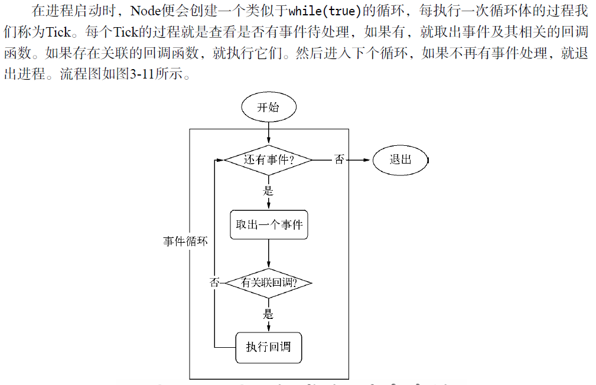
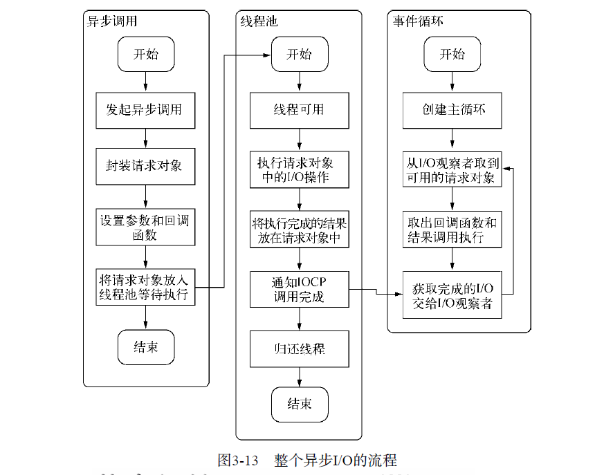
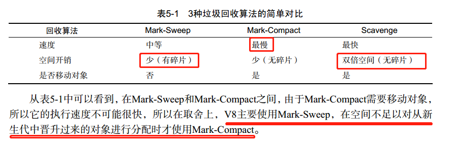

# 深入浅出Node.js看书笔记
《深入浅出Node.js》一书作者朴灵，阿里巴巴数据平台，长期进行nodejs研究，算是国内NodeJS权威人士

## 第三章 异步IO
### 异步IO的方案
操作系统对异步IO有两种，一种是阻塞，在调用异步Io时，应用程序需要等待IO完成才返回结果。另一种是非阻塞，在调用之后立即返回，并不带回数据，要获取数据需要通过文件描述符再次读取。应用程序需要重复调用IO操作来确认是否完成，这种重复调用判断的操作是否完成叫**轮询**。

**轮询**操作也经历过发展，在原文上有几种轮询方案的示意图，比较清楚的介绍了区别，下面简单文字概括一下。
* read 最原始，性能最低。通难过往复检查IO的状态来完成完整的数据读取。CPU一直用在等待上。
* select 改进方案，通过诺文件描述符上的是事件状态来判断。但是采用的是一个1024长度的数组存储，所以最多同时检查1024个文件描述符。
* poll 采用链表存储方式避免数组长度限制。其次还能避免不必要的检查。
* epoll 进入轮询时如果没有检查到IO事件，就是进入休眠，知道事件发生唤醒，直接利用了事件通知，执行回调的方式，而不是遍历查询，效率较高。

### Node异步IO的方案
Node通过只剩的执行模型--**事件循环**。

注意理解这个过程中的很重要的一个中间产物--请求对象。 接下来就是执行回调

创建请求对象，设置参数和回调，将请求对象放入线程池等待执行 ，然后到线程池有可以用线程，开始执行请求对象中的IO操作，将执行完成的结果放在请求对象中，同孩子IOCP，归还线程，这时IOCP给到事件循环的观察者，取出回调函数和结果执行回调。时间循环就是有进来的就循环检查执行。

事件循环，观察者，请求对象，IO线程池，这四者共同构成了Node异步IO模型的基本要求。

### 非IO的异步API
**定时器**： setTimeout，setInterval

**process.nextTick**  
有一个队列，吗，每次执行会将回调放入到队列中，子啊下一轮的Tick时取出来执行，定时器采用的红黑树时间还有可能不准，操作时间复杂度为O(lg(n))。nextTick()的时􁫍复杂􀤎为O(1)

**setImmediate**  
和nextTick类似，将回调函数延迟执行。但是有区别。
process.nextTick()中的回调函数执行的优先级要高于setImmediate()。
这是因为事件循环对观察者的检查是有先后顺序的，process.nextTick()属于于idle观察者，
setImmediate()属于check观察者。在每一轮轮询检查中，idle观察者先于I/O观察者，I/O观察者先于于check观察者。

在具体表现上，process.nextTick的回调函数保存在一个数组中，setImmediate的结果则是保存在链表中。行为上，nextTick在每轮循环中会将数组中的回调函数全部执行完，二serImmediate在每轮循环中执行链表中的第一个回调函数。书上有一段代码示例。

### Node高性能
服务器模型：
* 同步式。对于同步式的服务，一次只能处理一个请求，其余的全部处于等待状态。
* 每进程/每请求。为每个请求启动一个进程，可以处理多个，但是资源有限，不具备扩展性。
* 每线程/每请求。 为每个请求启动一个线程。每个线程需要占用内存，当大并发时，内训很快用光，导致服务变慢。
每线程/每请求这种方案目前还被Apache所采用。Node通过事件驱动的方式处理请求，无须为每一个请求创建额外的对应线程，可以省掉创建线程和销毁线程的开销，同时操作系统在调度任务时因为线程较少，上下文切换的代价较低，使得服务器能够有条不紊的处理请求，，及时大量连接的情况下。这就是Node高性能的原因。

## 第五章 内存控制

### V8的垃圾回收机制
因为Node的诞生跟V8有着很大关系，所以，Node的垃圾回收机制采用的是V8 引擎的回收方式。  
* V8对内存大小有着限制，64位系统下1.4G，32位系统下0.7G。加上新生代内存，严格意义上来说，64位系统堆内存位1464MB，32位系统上为732MB
* V8内存分类为新生代内存和老生代内存。
* **Scavenge**算法回收。 分成两块内存From和To，将From中存活对象移到To中，非存活对象释放，From和To会校色互换。特点是：**牺牲空间换时间**
* 对象从新生代到老生代的过程叫做晋升。条件有两个：一个是对象是否经历过Scavenge回收，二是To空间的内存占比是否超过限制（25%）。
* **Mark-Sweep**回收 ：标记过程-遍历所有对象，标记活着的；随后清除标记过程，只清除没有标记的对象（即死亡对象）。问题是没有移动，内存会出现不连续，成为碎片。
* **Mark-Compact**回收：在Mark-Sweep标记死亡后，清除整理过程将对象移动到一端，移动完成，直接清理掉边界外的内存。
* 三种清除方式都是**全停顿**。为了监听全停顿带来的影响。使用**增量标记**的方式优化

### 高效使用内存 & 内存指标
* JS 作用域域闭包使用的问题。
* 查看进程内存占用各种方法，例如： `process.memoryUsage()`

### 内存泄露
* 原因一般为：缓存、队列消费不及时、作用域位未释放
* Node中关于解决缓存造成的内存泄漏。1、
  1. 将缓存转移到外部，减少常驻内存的对象数量，让垃圾回收更高效
  2. 进程之间科共享缓存
* 内存泄漏排查工具。 `v8-profiler` `node-heapdump` , `node-mtrace`, `dtrace`, `node-memwatch`

